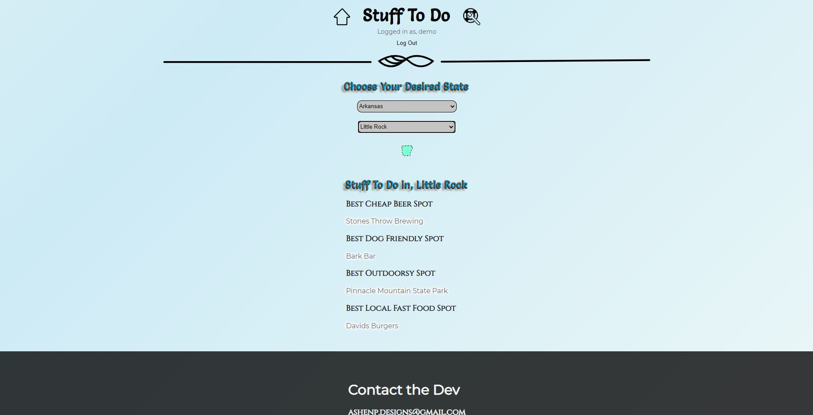

# Stuff To Do!
This app will allow a user to create an account/ login, and then view a currated list of things to do in cities accross the US.

### 1. Working Prototype
You can access a working prototype of the React app here: https://stuff-to-do.vercel.app/ and Node app here: https://stuff-to-do.herokuapp.com/

### 2. User Stories
This app is for two types of users: a visitor and a logged-in user

###### Landing Page (Importance - High) (Est: 1h)
* As a visitor
    * I can sign up, or log in
    * If I sign up I'll be able to log in later
    * If I log in, I'll be registered as a logged in user

######  Sign Up (Importance - High)  (Est: 3h)
* As a visitor
    * I want to register to use this app
    * So I can create a personal account.

######  Home Page (Importance - High)  (Est: 2h)
* As a visitor,
    * I want to be able to preview the content of the app,
    * So i can decide which location I want to navigate to.
    * Once I choose a state a city selector should pop up
    * Once the search is narrowed down I should be able to see a few things to do in that city

###### Suggestions Page (Importance - Medium) (Est: 5h)
* as a logged-in user
    * I can make suggestions for added places and things

### 3. Functionality
The app's functionality includes:
* Every User has the ability to
    * create an account
    * use the app to discover things to do around the US
* Every logged in User has the added ability to
    * make suggestions on new places and things to add

### 4. Technology
* Front-End: HTML5, CSS3, JavaScript ES6, React
* Back-End: Node.js, Express.js, Mocha, Chai, RESTful API Endpoints, PostgreSQL
* Development Environment: Heroku, DBeaver, Vercel

### 5. Wireframes

Home Page
:------------------:

Suggestions Page
:------------------:

### 6. Front-end Structure - React Components Map (to do later)
* (Example) __Index.js__ (stateless)
    * __App.js__ (stateful)
        * __LandingPage.js__ (stateful) - gets the _"prop name"_ and the _"callback prop name"_ from the __App.js__
            * __Suggestion.js__ (stateful) -
            * __StateSelector.js__ (stateful) -
                * __(LOCATION).js__ (stateful) -
                    * __CityInfo.js__ (stateful) -
            * __SignUp.js__ (stateful) -
        * __Header.js__ (stateless) -
        * __Footer.js__ (stateless) -

### 7. Back-end Structure - Business Objects
* users (database table)
    * id (auto-generated)
    * username (email validation)
    * password (at least 8 chars, at least one alpha and a special character validation)

* states (database table)
    * id (auto-generated)
    * state (expect to be a string && varchar 255 characters)
    * city (expect to be a string && varchar 255 characters)
    * best_cheap_beer_spot (expect to be a string && varchar 255 characters)
    * bcbs_link (expect to be a string && varchar 255 characters)
    * best_dog_friendly_spot (expect to be a string && varchar 255 characters)
    * bdfs_link (expect to be a string && varchar 255 characters)
    * best_outdoorsy_spot (expect to be a string && varchar 255 characters)
    * bos_link (expect to be a string && varchar 255 characters)
    * best_local_fast_food_spot (expect to be a string && varchar 255 characters)
    * blffs_link (expect to be a string && varchar 255 characters)

* suggestions (database table)
    * id (auto-generated)
    * for_place (expect to be a string && varchar 255 characters)
    * suggestion (expect to be a string && varchar 255 characters)

### 8. API Documentation
API Documentation details:
* (Example) get all users

### 9. Screenshots
Landing/Login Page
:------------------:

Sign Up Page
:------------------:

Home Page
:------------------:

Suggestion Page
:------------------:

### 10. Development Roadmap
This is v0.5 of the app, but future enhancements are expected to include:
* information for more places
* a voting system for the next place to be covered
* a more optimized suggestions system that semi automates stright into the states store

### 11. How to run it (done)
Use command line to navigate into the project folder and run the following in terminal

##### Local React scripts
* To install the react project ===> npm install
* To run react (on port 8000) ===> npm start
* To run tests ===> npm run test

##### Local Node scripts
* To install the node project ===> npm install
* To migrate the database ===> npm run migrate -- 1
* To run Node server (on port 8000) ===> npm run dev
* To run tests ===> npm run test
